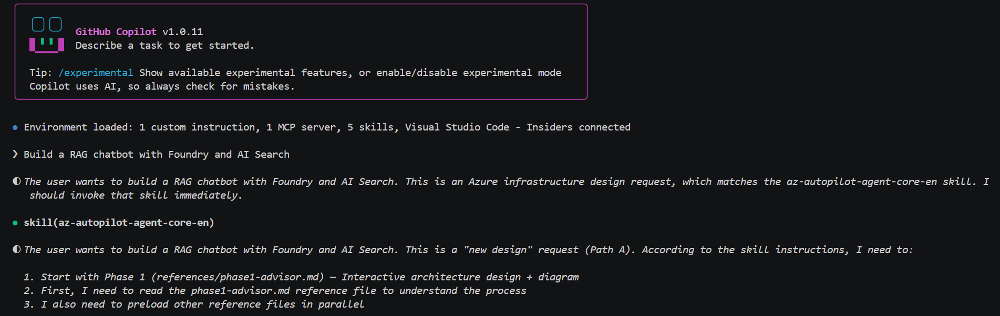
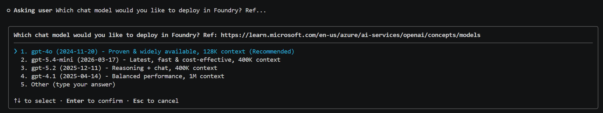
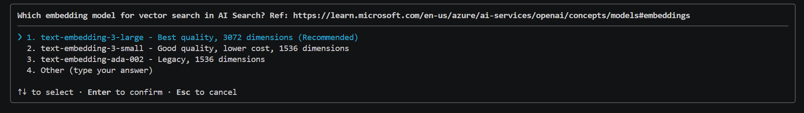
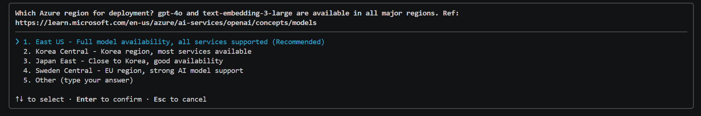
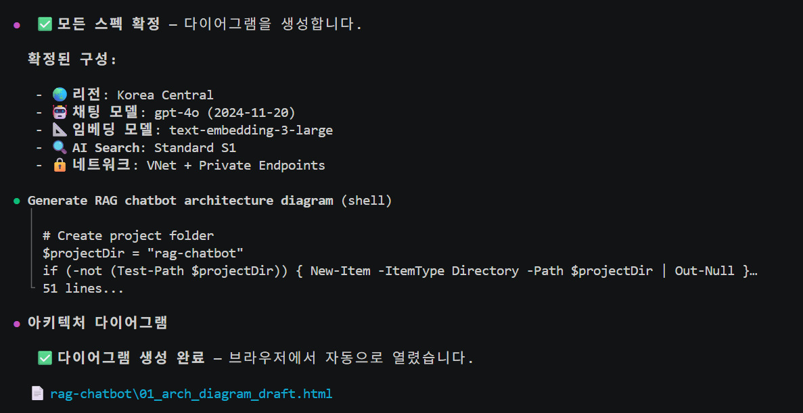
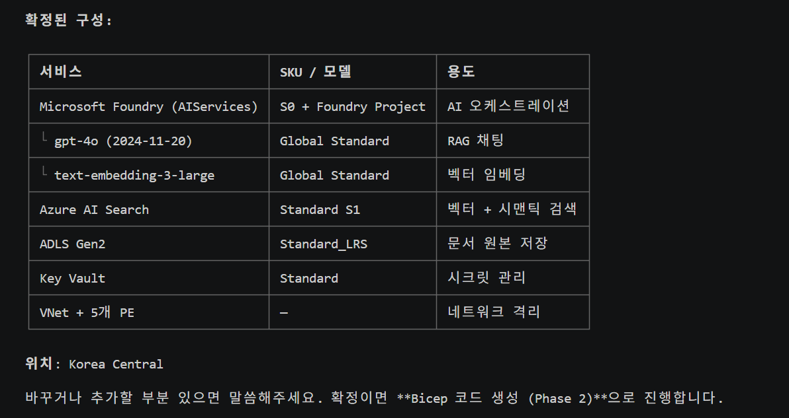
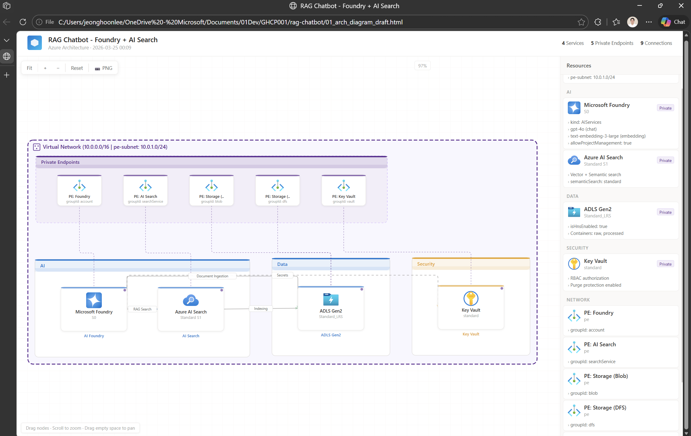
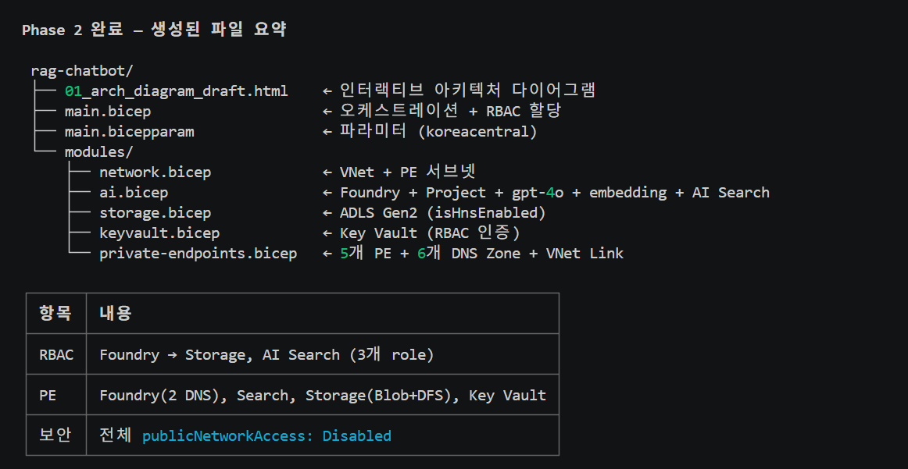

# az-autopilot-agent-core-en

> Design Azure infrastructure in natural language — or scan existing resources, visualize the architecture, and modify it through conversation.

---

## 🔄 What It Does

```
Path A: "Build me a RAG chatbot"
         ↓
  🎨 Phase 1 → 🔧 Phase 2 → ✅ Phase 3 → 🚀 Phase 4

Path B: "Analyze my current Azure resources"
         ↓
  🔍 Phase 0 (Scan) → 🎨 Phase 1 (Modify) → 🔧→✅→🚀
```

| Phase | Name | Description |
|-------|------|-------------|
| **0** | 🔍 Resource Scanner | Scan existing Azure resources → auto-generate architecture diagram |
| **1** | 🎨 Architecture Advisor | Interactive design or modification through conversation |
| **2** | 🔧 Bicep Generator | Auto-generate modular Bicep templates |
| **3** | ✅ Code Reviewer | Compile check + security/best-practice review |
| **4** | 🚀 Deployer | Validate → What-if → Preview diagram → Deploy |

**All Azure services supported** — optimized for AI/Data services, others auto-looked up from MS Docs.

---

## ⚙️ Prerequisites

| Tool | Required | Install |
|------|----------|---------|
| **GitHub Copilot CLI** | ✅ | [Install guide](https://docs.github.com/copilot/concepts/agents/about-copilot-cli) |
| **Azure CLI** | ✅ | `winget install Microsoft.AzureCLI` |
| **Python 3** | ✅ | `winget install Python.Python.3.12` |

No additional packages required — the diagram engine is bundled in `scripts/`.

### 🤖 Recommended Models

| | Models | Notes |
|---|---|---|
| ✅ **Recommended** | Claude Sonnet 4.5 / 4.6 | Best cost-performance |
| 🏆 **Best** | Claude Opus 4.5 / 4.6 | Most reliable |
| ⚠️ **Minimum** | Claude Sonnet 4, GPT-5.1+ | May skip steps |

---

## 🚀 Usage

### Path A: Build new infrastructure

```
"Build a RAG chatbot with Foundry and AI Search"
"Create a data platform with Databricks and ADLS Gen2"
"Deploy Fabric + ADF pipeline with private endpoints"
```

### Path B: Analyze & modify existing resources

```
"Analyze my current Azure infrastructure"
"Scan rg-production and show me the architecture"
"What resources are in my subscription?"
```

Then modify with natural language:
```
"Add 3 VMs to this architecture"
"The Foundry endpoint is slow — what can I do?"
"Reduce costs — downgrade AI Search to Basic"
"Add private endpoints to all services"
```

---

## 📸 Demo: Building a RAG Chatbot (Path A)

### Step 1 — Just describe what you want

Type a natural language request. The skill is automatically invoked and starts Phase 1.



### Step 2 — Interactive Q&A guides your choices

The skill asks targeted questions with recommended defaults — model selection, SKU, networking, etc.




The skill also asks about deployment region with availability-aware recommendations.



### Step 3 — Architecture diagram auto-generated

Once all specs are confirmed, an interactive HTML diagram is generated and opened in the browser.



### Step 4 — Review and confirm the architecture

A detailed configuration table is presented for final review before proceeding to Bicep generation.



### Step 5 — Interactive architecture visualization

The generated diagram is fully interactive — drag nodes, zoom, click for details. 605+ official Azure icons.



### Step 6 — Bicep code auto-generated

Phase 2 generates modular Bicep templates with RBAC, Private Endpoints, and DNS configuration.



---

### 📂 Output structure

```
<project-name>/
├── 00_arch_current.html        ← Scanned architecture (Path B)
├── 01_arch_diagram_draft.html  ← Design diagram
├── 02_arch_diagram_preview.html ← What-if preview
├── 03_arch_diagram_result.html  ← Deployment result
├── main.bicep
├── main.bicepparam
└── modules/
    └── *.bicep
```

---

## 🌐 Language Support

Auto-detects your language. All output adapts — English, Korean, or any language.

---

## ✨ Key Features

- 📦 **Zero-dependency diagrams** — 605+ Azure official icons bundled, no pip install needed
- 🔍 **Resource scanning** — Analyze existing Azure resources and auto-generate architecture diagrams
- 💬 **Natural language modification** — "It's slow", "reduce costs", "add security" → guided resolution
- 📊 **Live MS Docs verification** — API versions, SKUs, model availability fetched in real-time
- 🔒 **Security by default** — Private Endpoint, RBAC, no secrets in files
- 🎨 **Interactive diagrams** — Clickable, draggable HTML architecture visualization with PNG export
- ⚡ **Parallel preloading** — Next-step info loaded while waiting for input

---

## 📁 Architecture

```
SKILL.md (Router ~170 lines)
├── scripts/                       ← Embedded diagram engine (605+ icons)
│   ├── generator.py               ← Main diagram generator
│   ├── icons.py                   ← Azure official icons (Base64 SVG)
│   ├── cli.py                     ← CLI entry point
│   └── REFERENCE.md               ← Service type reference
├── references/                    ← Phase instructions + service patterns
│   ├── phase0-scanner.md          ← Existing resource scan
│   ├── phase1-advisor.md          ← Architecture design/modify
│   ├── bicep-generator.md         ← Bicep generation
│   ├── bicep-reviewer.md          ← Code review
│   ├── phase4-deployer.md         ← Deployment pipeline
│   ├── service-gotchas.md         ← Required properties, PE mappings
│   ├── azure-common-patterns.md   ← PE/security/naming patterns
│   ├── azure-dynamic-sources.md   ← MS Docs URL registry
│   ├── architecture-guidance-sources.md ← Architecture guidance
│   └── ai-data.md                 ← AI/Data service guide
└── .gitignore
```

SKILL.md is a lightweight router. All phase logic lives in `references/`.

**Self-contained** — no `pip install` needed. Diagram engine is embedded in `scripts/`.

---

## 📊 Supported Diagram Types (47+)

Full list: `python scripts/cli.py --reference`

Key types: `ai_foundry`, `openai`, `ai_search`, `storage`, `adls`, `keyvault`, `fabric`, `databricks`, `aks`, `vm`, `app_service`, `function_app`, `cosmos_db`, `sql_server`, `synapse`, `adf`, `app_insights`, `log_analytics`, `firewall`, `front_door`, `redis`, `event_hub`, `iot_hub`, `acr`, `bastion`, `vpn_gateway`, `document_intelligence` ...

---

## License

MIT
