# Azure Architecture Diagram Test Report

20 architectures — all with screenshots ✅

---

## ⭐ Level 1

### 01. Static Website

**Blob static hosting + Azure CDN**

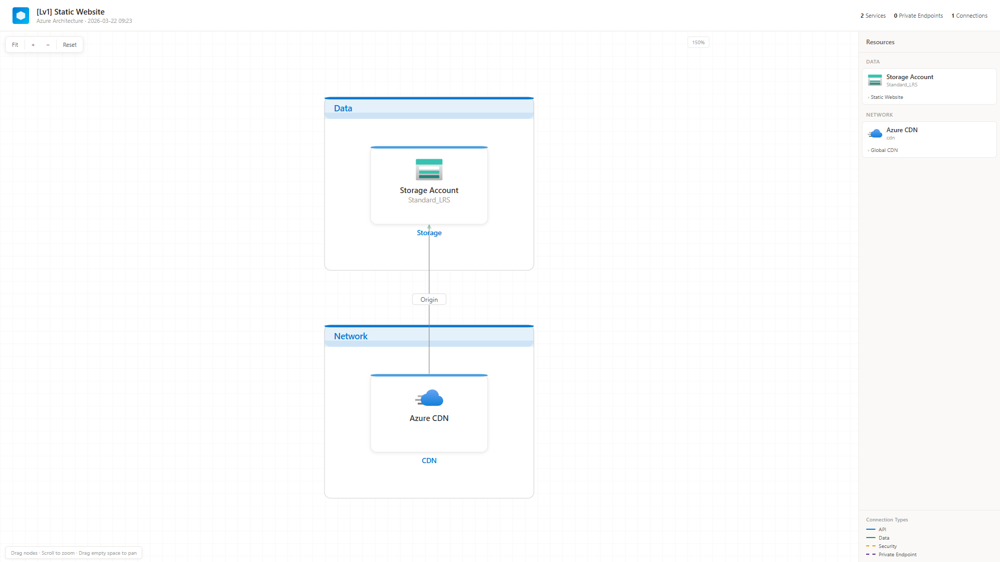

📄 [01-static-website.html](01-static-website.html)

---

### 02. Basic Web App

**App Service + SQL Database**

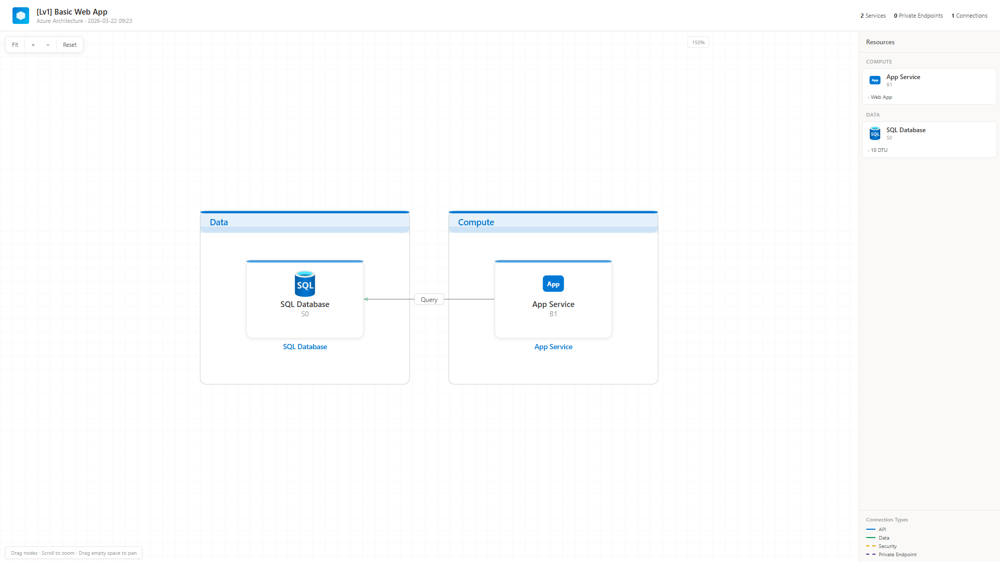

📄 [02-basic-web-app.html](02-basic-web-app.html)

---

### 03. Serverless API

**Function App + Cosmos DB**

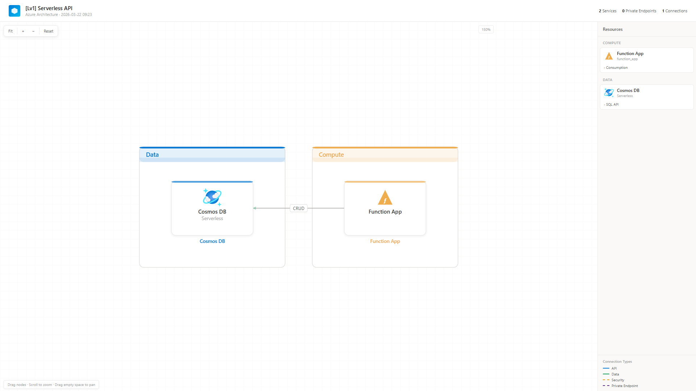

📄 [03-serverless-api.html](03-serverless-api.html)

---

### 04. Key Vault Pattern

**App Service + Key Vault secret reference**

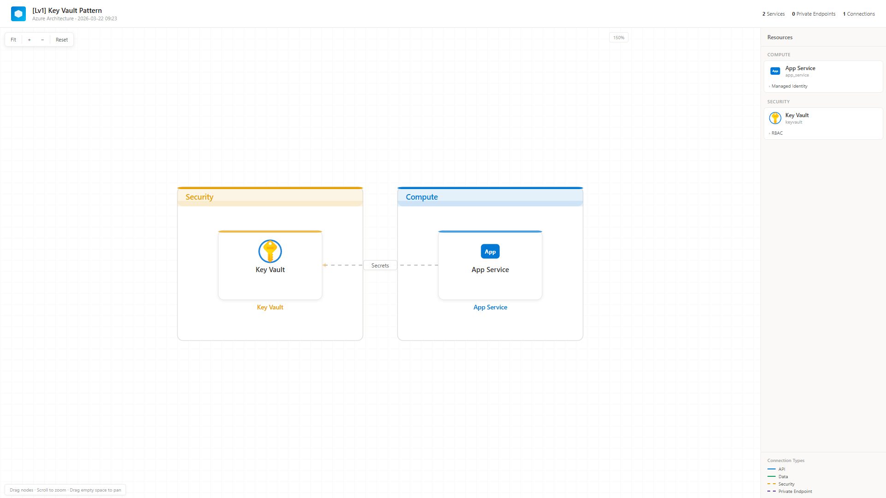

📄 [04-key-vault-pattern.html](04-key-vault-pattern.html)

---

## ⭐⭐ Level 2

### 05. Basic RAG Chatbot

**Foundry + AI Search + Storage + Key Vault**

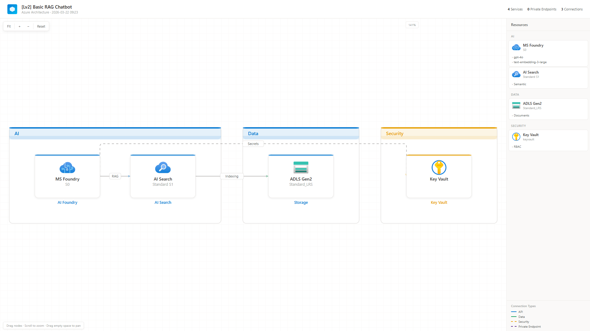

📄 [05-basic-rag-chatbot.html](05-basic-rag-chatbot.html)

---

### 06. Web App + Cache

**App Service + SQL + Redis + App Insights**

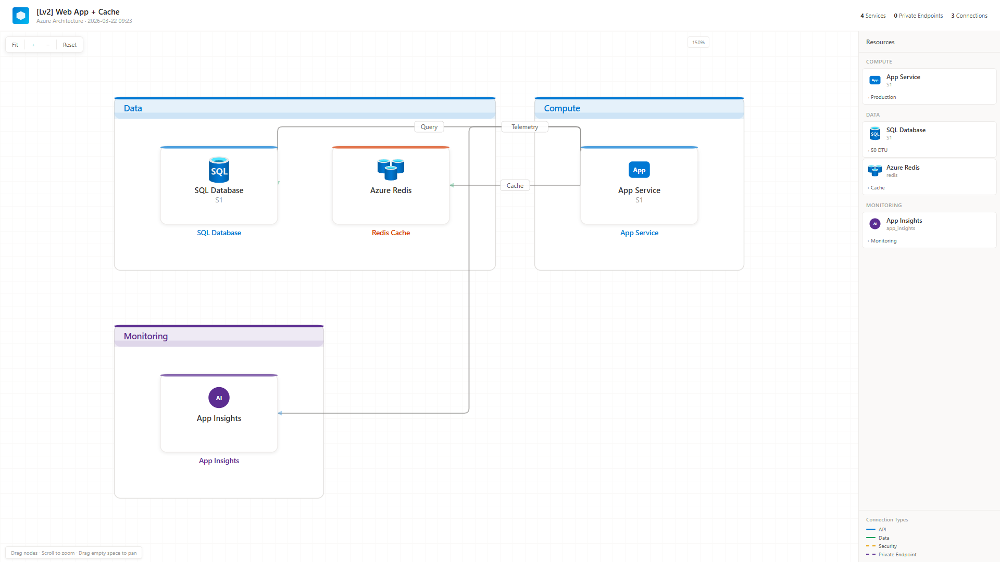

📄 [06-web-app-+-cache.html](06-web-app-+-cache.html)

---

### 07. Event-Driven Processing

**Event Hub + Function App + Cosmos DB**

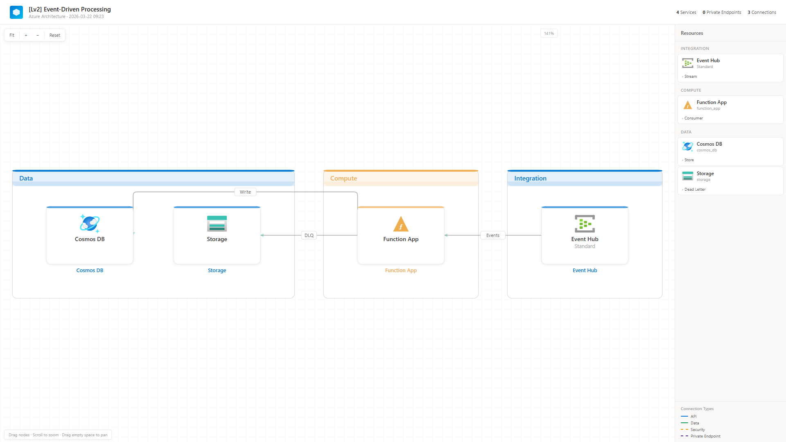

📄 [07-event-driven-processing.html](07-event-driven-processing.html)

---

### 08. CI/CD Pipeline

**DevOps + ACR + AKS**

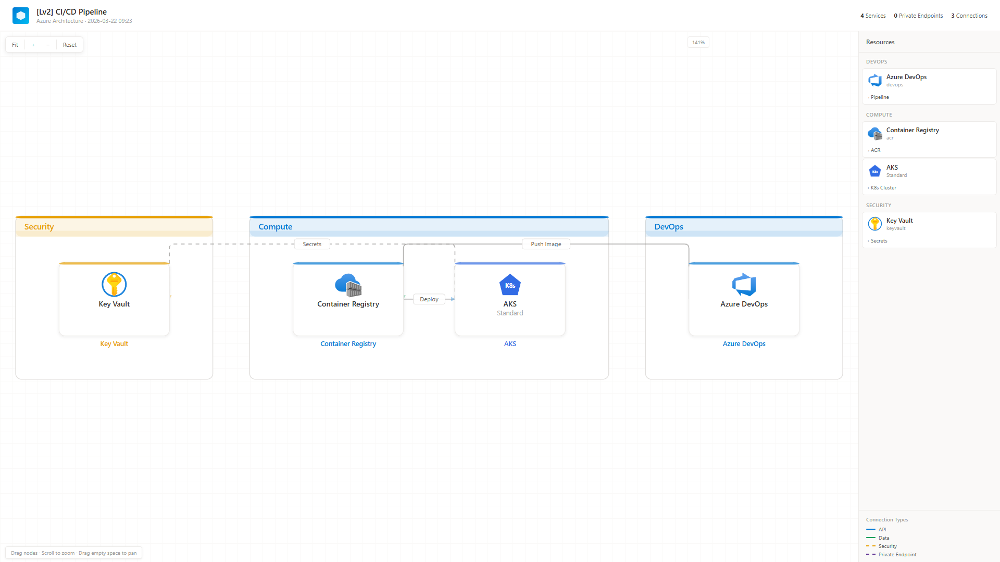

📄 [08-ci-cd-pipeline.html](08-ci-cd-pipeline.html)

---

## ⭐⭐⭐ Level 3

### 09. RAG Chatbot (Private)

**Full PE isolation**

.png)

📄 [09-rag-chatbot-(private).html](09-rag-chatbot-(private).html)

---

### 10. Data Lakehouse

**Databricks + ADLS Gen2 + ADF**

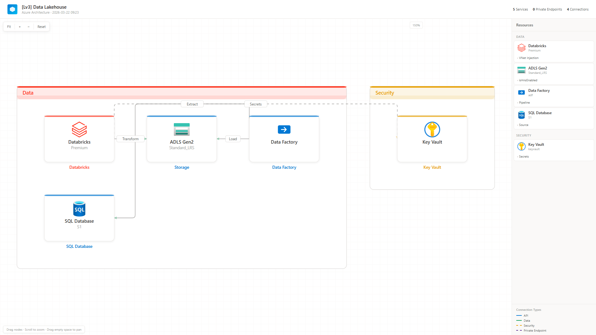

📄 [10-data-lakehouse.html](10-data-lakehouse.html)

---

### 11. Microservices (AKS)

**AKS + ACR + SQL + Redis + App Gateway**

.png)

📄 [11-microservices-(aks).html](11-microservices-(aks).html)

---

### 12. IoT Solution

**IoT Hub + Stream Analytics + Cosmos**

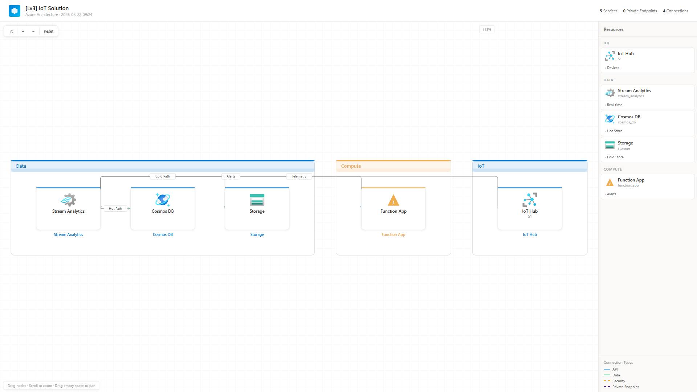

📄 [12-iot-solution.html](12-iot-solution.html)

---

## ⭐⭐⭐⭐ Level 4

### 13. Enterprise RAG

**Enterprise AI with monitoring + bastion**

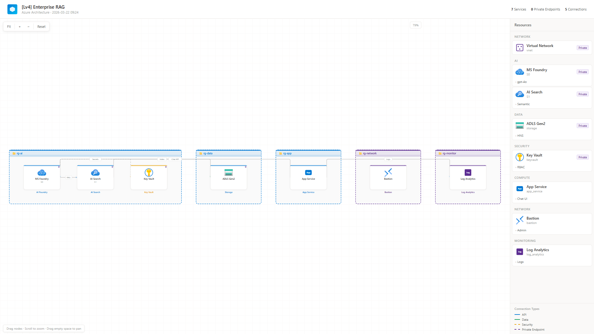

📄 [13-enterprise-rag.html](13-enterprise-rag.html)

---

### 14. Data Analytics Platform

**Fabric + Databricks + ADLS + ADF**

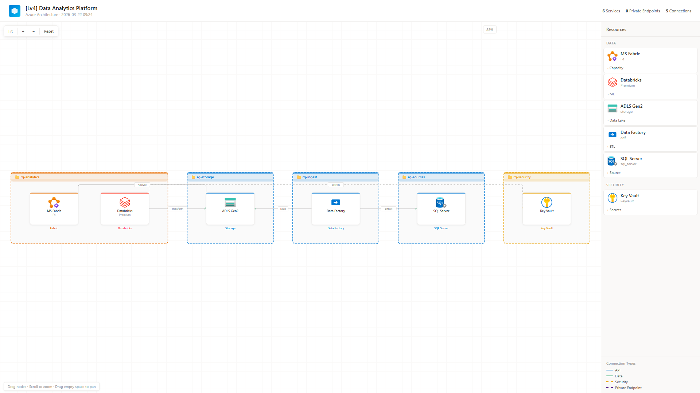

📄 [14-data-analytics-platform.html](14-data-analytics-platform.html)

---

### 15. Hybrid Network

**VPN + Firewall + Bastion + Hub-Spoke**

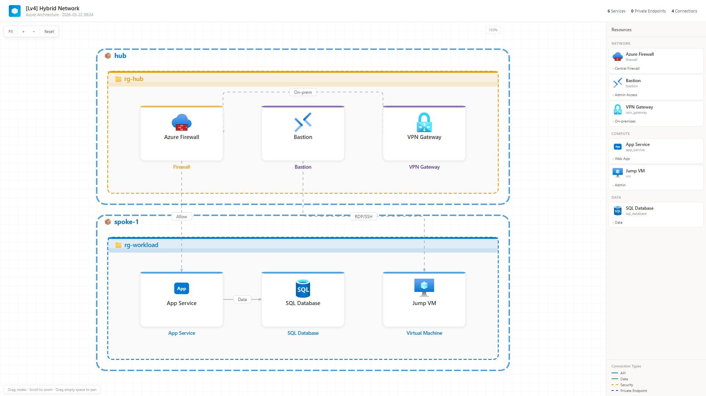

📄 [15-hybrid-network.html](15-hybrid-network.html)

---

### 16. Multi-tier Web App

**App Gateway + App Service + SQL + Redis + CDN**

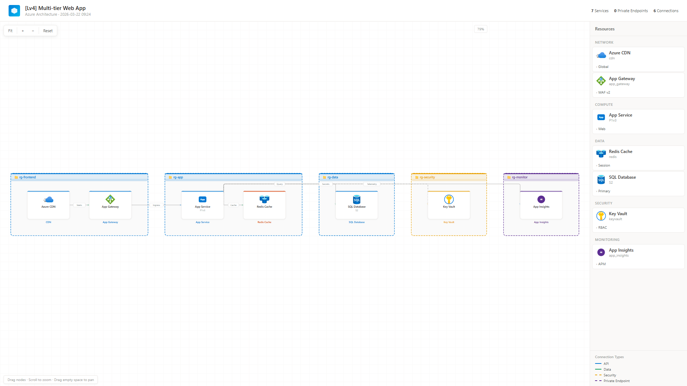

📄 [16-multi-tier-web-app.html](16-multi-tier-web-app.html)

---

## ⭐⭐⭐⭐⭐ Level 5

### 17. Azure Landing Zone

**Enterprise governance — Hub + 2 Spokes**

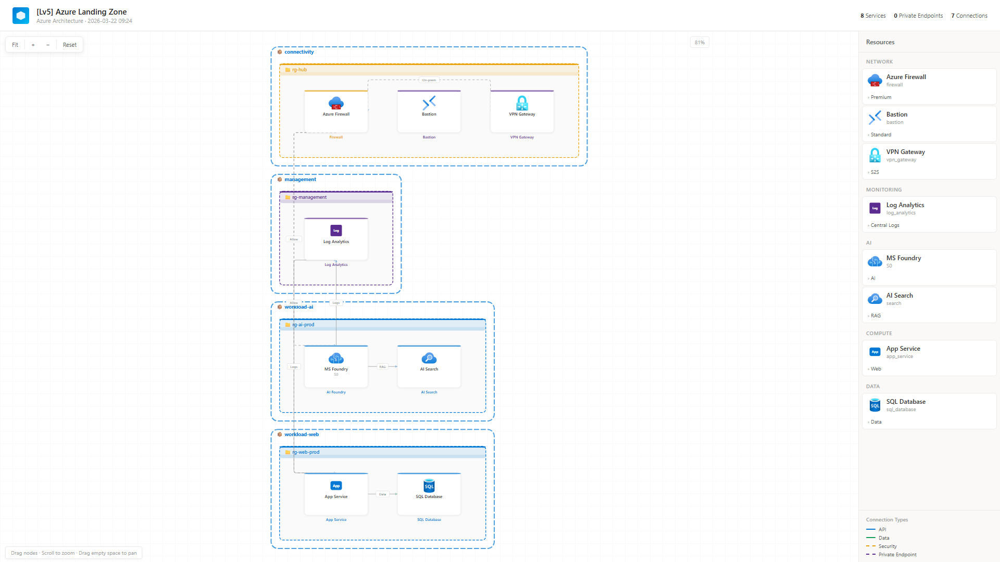

📄 [17-azure-landing-zone.html](17-azure-landing-zone.html)

---

### 18. Mission-Critical AKS

**Multi-region AKS + Front Door + Cosmos**

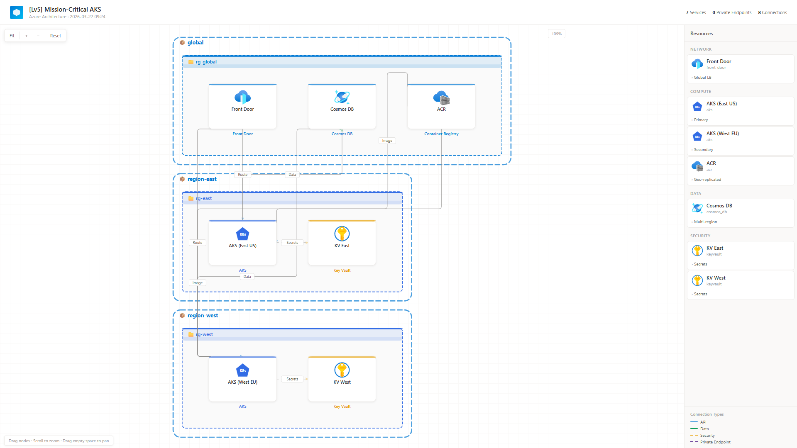

📄 [18-mission-critical-aks.html](18-mission-critical-aks.html)

---

### 19. AI/ML Platform

**Full AI lifecycle**

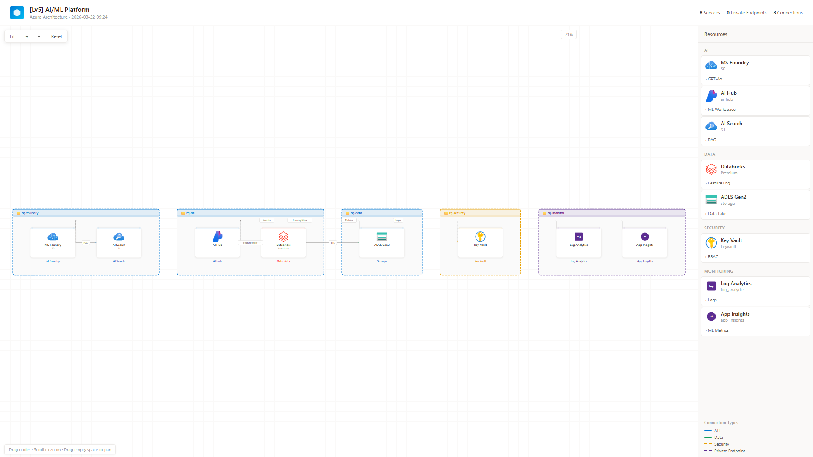

📄 [19-ai-ml-platform.html](19-ai-ml-platform.html)

---

### 20. Data Mesh

**Distributed data governance**

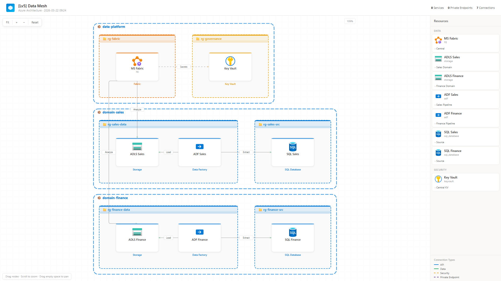

📄 [20-data-mesh.html](20-data-mesh.html)

---

